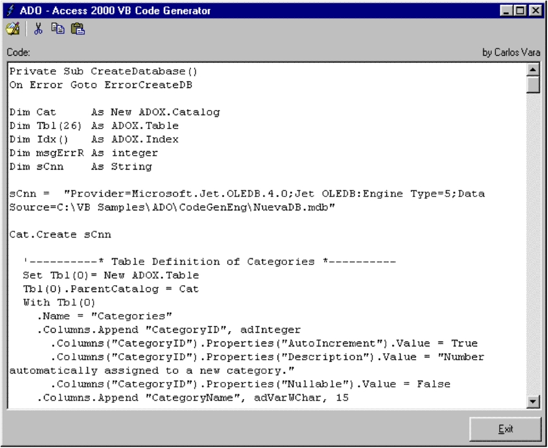



## A D O \- Access 2000 VB Code Generator 1\.1\.0\!

### Description

Automatically generate a function to create an Access 2000 Database With ADO. I catalogue this program like a utility. This utility generates a function that you can use inside your apps to create an Access 2000 Database With ADO Reviewed Verion 1.1.0!
 
### More Info
 

             |
---                |---
**Submitted On**   |2001-12-04 16:28:18
**By**             |[Carlos Vara](https://github.com/Planet-Source-Code/PSCIndex/blob/master/ByAuthor/carlos-vara.md)
**Level**          |Intermediate
**User Rating**    |4.9 (209 globes from 43 users)
**Compatibility**  |VB 5\.0, VB 6\.0
**Category**       |[Databases/ Data Access/ DAO/ ADO](https://github.com/Planet-Source-Code/PSCIndex/blob/master/ByCategory/databases-data-access-dao-ado__1-6.md)
**World**          |[Visual Basic](https://github.com/Planet-Source-Code/PSCIndex/blob/master/ByWorld/visual-basic.md)
**Archive File**   |[A\_D\_O\_\-\_Ac486011142002\.zip](https://github.com/Planet-Source-Code/carlos-vara-a-d-o-access-2000-vb-code-generator-1-1-0__1-30788/archive/master.zip)

